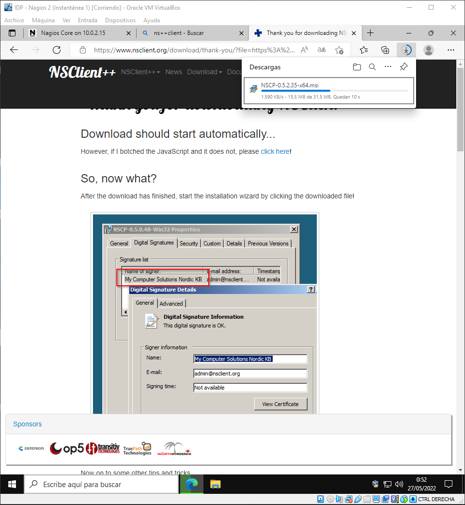
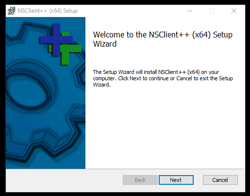
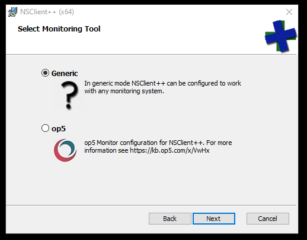
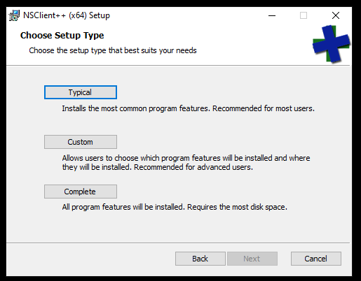
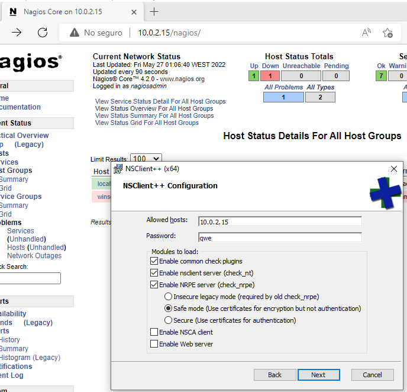
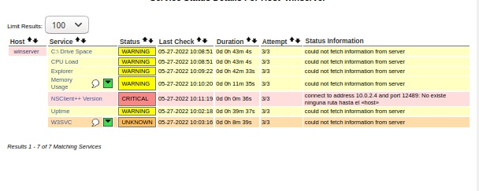

Para configurar el cliete vamos primero a descargarnos el NSClient++ de la pagina oficial.
Este paso no es esencial para entrar a la pagina del Nagios en el cliente pero es recomendable tenerlo.

Le damos a Next dos veces.

Le damos a Typical y a Next.

Seleccionamos las 3 primeras casillas y le damos a Next y estaria terminada la instalacion.

Hecha la instalacion del Server de Nagios para probarlo tenemos que irnos a cualquier navegador y poner la IP del servidor y /nagios luego. En este caso seria 10.0.2.15/nagios

Le damos a Servicios y vemos lo que tenemos con error, en peligro o funcionando correctamente.

