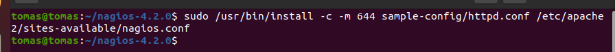
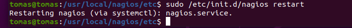

instalar cosas

sudo apt-get install wget build-essential apache2 php libapache2-mod-php php-gd libgd-dev

crear usuario y grupo

sudo useradd nagios

sudo groupadd nagcmd

sudo usermod -a -G nagcmd nagios

sudo usermod -a -G nagios,nagcmd www-data

descargar y instalar nagios
wget https://assets.nagios.com/downloads/nagioscore/releases/nagios-4.2.0.tar.gz

tar -xzf nagios-4.2.0.tar.gz

cd nagios-4.2.0

sudo ./configure --with-nagios-group=nagios --with-command-group=nagcmd

compilar

sudo make all

sudo make install

sudo make install-init

sudo make install-commandmode

sudo make install-config

generar archivo de ejemplo

sudo /usr/bin/install -c -m 644 sample-config/httpd.conf /etc/apache2/sites-available/nagios.conf

activar módulos en apache2

sudo a2enmod rewrite

sudo a2enmod cgi

darle permisos al usuario nagios

sudo htpasswd -c /usr/local/nagios/etc/htpasswd.users nagiosadmin

qwe

reiniciar servicios

sudo /etc/init.d/apache2 restart

sudo /etc/init.d/nagios restart

luego ver IP de la máquina y ya el cliente

Antes de probar nagios no podrias ya que no esta enlazado

Enlazar

sudo ln -s /etc/apache2/sites-available/nagios.conf /etc/apache2/sites-enabled

para que se nos enlace reiniciamos el servicio

sudo /etc/init.d/apache2 restart

Ya tenemos acceso a nuestro nagios pero no tiene ningún complemento funcionando

descargar plugins81.88.48.71

wget https://nagios-plugins.org/download/nagios-plugins-2.3.3.tar.gz

descomprimir

tar -xvzf nagios-plugins-2.3.3.tar.gz

cd nagios-plugins-2.3.3

sudo ./configure

sudo make

sudo make install

cd /usr/local/nagios/etc/objects 

una vez en esta carpeta accedemos a un fichero 

sudo nano windows.cfg

81.88.48.71

poner otro con esa ip para probarlo

AQUÍ PARA LA WEB DEL CENTRO CREÓ OTRO HOST CON LA IP DE LA PÁGINA DEL CENTRO PARA MONITOREARLO

Una vez terminado esto vamos a descomentar windows

cd /usr/local/nagios/etc

sudo nano nagios.cfg

para que coja el fichero de configuración de nagios 

sudo /usr/local/nagios/bin/nagios -v /usr/local/nagios/etc/nagios.cfg

sudo /etc/init.d/nagios restart

